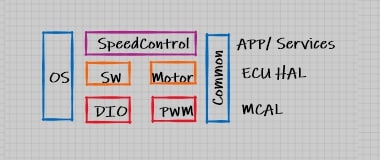
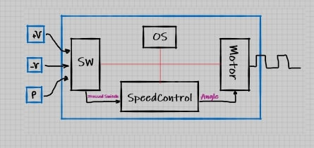
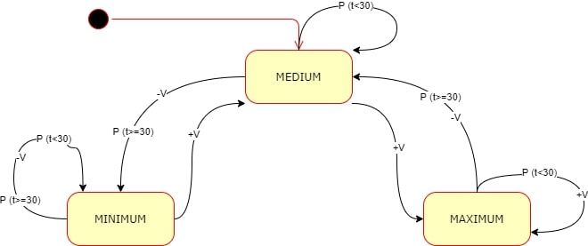
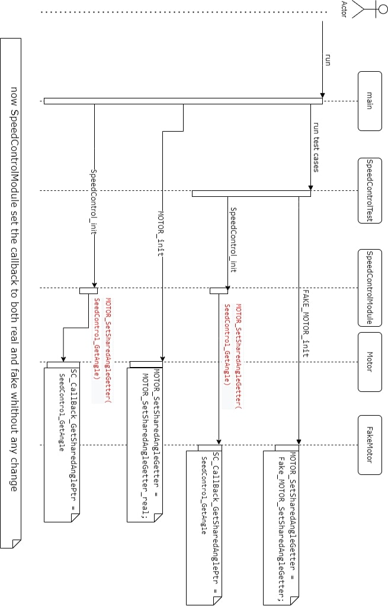
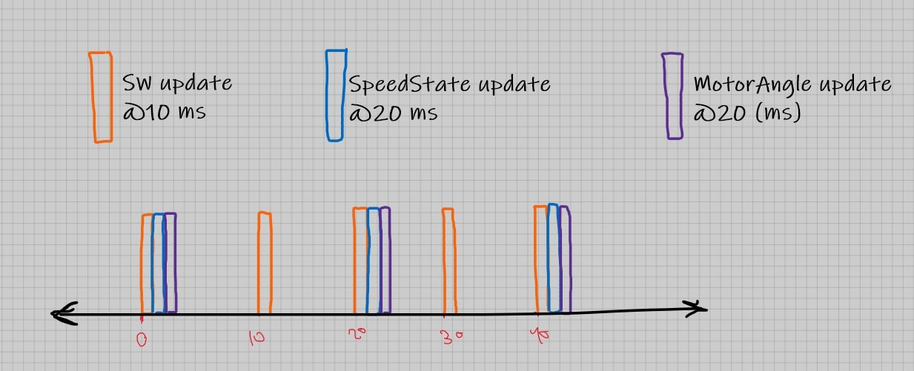
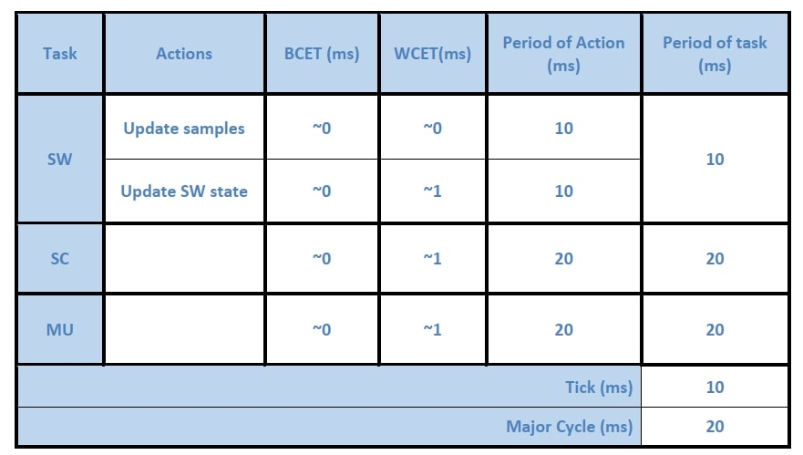
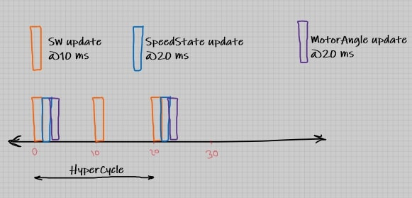

# SpeedControl using TDD concept.
 This project is an implementation of a simple speed control module for vacuum developed using the Test-Driven Development (TDD) concept.

# Design notes:

## System Static Architecture

## System Block Diagram 

## State Machine for Speed Control Module

## Sequence diagram for setting the callback.
in the real and fake motor, so as to let the SpeedControl module set the callback in both the Real and Fake Motor module without knowing the existance of the the fake motor module:

## APIs for modules
* Switch

    * SWITCH_init
    * SWITCH_update
    * SWITCH_GetPressedSwitch
* SpeedControl module
    * SpeedControl_init
    * SpeedControl_update
    * SpeedControl_GetSpeedState
    *  SpeedControl_GetAngle
* Motor
    * MOTOR_init
    * MOTOR_update
    * MOTOR_SetSharedAngleGetter

* OS
    * YO_eInit
    * YO_vCreateTask
    * YO_vStartScheduler

#  Timing Analysis
All analysis assume that there is no blocking points in the system.

## Approach 1

Average CPU load = (3)/15= 20%

Max sleep time = 4ms

Adv: Faster

### Schedulability Check

## Approach 2

Average CPU load = (4)/20= 20%

Max sleep time = 9 ms

Adv: longer life time (! maybe)

### Schedulability Check

IMPORTANT NOTE:
I`M TOTALLY NOT SURE ABOUT ANYTHING WRITTEN ABOVE,
THEY MAYBE RIGHT OR WRONG!